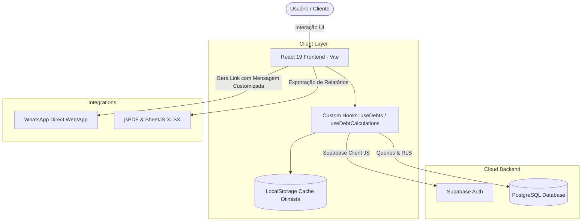
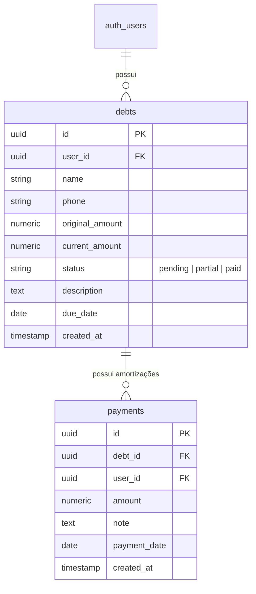

# 💚 Pagmefy - Sistema de Gestão de Débitos e Cobranças no WhatsApp

[](https://github.com/DeyvidSouzaB/sistemadebitos/actions/workflows/ci.yml)


[](LICENSE)

**Pagmefy** é uma solução SaaS financeira moderna, de alta performance e totalmente responsiva para gestão de devedores, controle de cobranças com suporte a amortização parcial/total e automação de lembretes e notificações via WhatsApp.

---

## 📸 Demonstração / Screenshots da Aplicação

| Dashboard Geral & Métricas | Gestão de Devedores & Filtros |
| :---: | :---: |
|  <br> *Visão geral financeira com indicadores de inadimplência e gráficos em tempo real.* |  <br> *Tabela iterativa com status visual, histórico de amortizações e busca dinâmica.* |

> 💡 **Nota**: O sistema inclui suporte completo a **Modo Visitante (Offline)** e sincronização transparente na nuvem através do **Supabase**.

---

## 🛠️ Stack Tecnológica

| Tecnologia | Versão | Descrição |
| :--- | :--- | :--- |
| **React** | `^19.0.1` | Biblioteca UI moderna para renderização com suporte a React 19 |
| **TypeScript** | `~5.8.2` | Tipagem estrita de ponta a ponta |
| **Vite** | `^6.2.3` | Bundler e ambiente de desenvolvimento ultrarrápido |
| **Tailwind CSS** | `^4.1.14` | Estilização utilitária de alta performance |
| **Supabase JS** | `^2.110.8` | Backend as a Service (Autenticação e Banco PostgreSQL) |
| **Vitest** | `^4.1.10` | Framework de testes unitários ultrarrápido |
| **Recharts** | `^3.10.0` | Gráficos interativos para dashboard financeiro |
| **Motion** | `^12.23.24` | Animações e transições fluidas de interface |

---

## 🏛️ Arquitetura do Sistema

O Pagmefy foi arquitetado seguindo os princípios de **Clean Architecture**, **Single Responsibility Principle (SRP)** e **Component-Driven Development**:

```
src/
├── __tests__/             # Suíte de testes unitários com Vitest
│   ├── dateUtils.test.ts
│   ├── financialCalculations.test.ts
│   ├── phoneUtils.test.ts
│   └── useDebtCalculations.test.ts
├── components/            # Componentes React modulares e reutilizáveis
│   ├── debt/              # Componentes de domínio específico (tabelas, cards, filtros)
│   ├── landing/           # Componentes 3D e seções da Landing Page
│   ├── ui/                # Design System base (Button, Modal, Input, Badge, Card)
│   ├── Dashboard.tsx      # Painel de controle e gráficos Recharts
│   ├── DevedoresView.tsx  # Tabela e ações de gestão de clientes
│   └── LandingPage.tsx    # Página institucional com Hero 3D interativo
├── constants/             # Constantes globais e chaves de armazenamento local
├── hooks/                 # Custom React Hooks para lógica de negócios isolada
│   ├── useAuth.ts         # Gerenciamento de sessão com Supabase Auth
│   ├── useDebtCalculations.ts # Cálculo de amortizações e consolidação de métricas
│   ├── useDebts.ts        # Sync com Supabase e fallback otimista no LocalStorage
│   └── useNavigation.ts   # Roteamento e navegação de abas
├── lib/                   # Integrações externas (Supabase Client, SQL Scripts)
├── types.ts               # Interfaces e Tipos TypeScript estritos
└── utils/                 # Utilitários puros para datas, moeda e links de WhatsApp
```

### 📐 Princípios Arquiteturais Aplicados

1. **Single Source of Truth (SSOT)**: Quando autenticado, o Supabase (PostgreSQL) atua como a fonte única da verdade com suporte a tempo real.
2. **Cache Otimista & Fallback Offline**: Em modo visitante ou em instabilidade de rede, os dados são gerenciados em `LocalStorage` de forma transparente sem quebrar a experiência.
3. **Tratamento de Fusos Horários (ISO Neutral Dates)**: Prevenção rigorosa de *date-rollback* ajustando datas com sufixos neutros em UTC (`T12:00:00.000Z`).
4. **Isolamento de Estado Domínio/UI**: Cálculos de amortização e métricas financeiras residem em custom hooks puros e testados unitariamente.

---

## 📊 Diagramas

### 1. Diagrama de Arquitetura & Fluxo de Dados



### 2. Diagrama de Relacionamento de Entidades (ERD)



---

## 🧪 Cobertura de Testes Automatizados

O repositório possui uma suíte robusta de testes unitários desenvolvida com **Vitest**, cobrindo todas as regras críticas de negócio financeiro e utilitários.

```
 ✓ src/__tests__/financialCalculations.test.ts  (5 tests)
 ✓ src/__tests__/dateUtils.test.ts              (7 tests)
 ✓ src/__tests__/useDebtCalculations.test.ts   (2 tests)
 ✓ src/__tests__/phoneUtils.test.ts             (3 tests)
 ✓ src/__tests__/useDebtFilters.test.ts         (5 tests)
 ✓ src/__tests__/useDashboardMetrics.test.ts    (4 tests)
 ✓ src/__tests__/debtorService.test.ts          (3 tests)

 Test Files  7 passed (7)
      Tests  29 passed (29)
   Duration  ~1.5s
```

### Regras Testadas:
- 🟢 **Amortização Parcial/Total**: Redução correta do saldo devedor ao registrar pagamentos.
- 🟢 **Transição de Status**: Alteração automática de `pending` -> `partial` -> `paid`.
- 🟢 **Isolamento de Datas**: Garantia de que datas de vencimento não sofrem regressão de fuso horário.
- 🟢 **Sanitização de Telefones & WhatsApp**: Formatação e geração de mensagens pré-formatadas para cobrança direta.
- 🟢 **Filtros de Devedores**: Ordenação, busca e filtragem por status e vencimento.
- 🟢 **Métricas do Dashboard**: Cálculo correto de totais, inadimplência e recebíveis.
- 🟢 **Serviço de Devedores**: Busca e agregação de dados por cliente.

### Como Executar os Testes
```bash
# Rodar todos os testes unitários
npm run test

# Gerar relatório de cobertura (requer @vitest/coverage-v8)
npm run test:coverage
```

---

## 🚀 Instruções de Deploy

### 1. Deploy na Vercel / Netlify

1. Faça o fork/clone deste repositório no seu GitHub.
2. Importe o projeto no painel da **Vercel** ou **Netlify**.
3. Configure o comando de Build: `npm run build`
4. Configure o diretório de saída (Output Directory): `dist`
5. Adicione as **Variáveis de Ambiente**:
   ```env
   VITE_SUPABASE_URL=https://seu-projeto.supabase.co
   VITE_SUPABASE_ANON_KEY=sua-chave-anonima-aqui
   ```

### 2. Deploy via Docker

Crie um arquivo `Dockerfile` ou execute o build do container:

```dockerfile
FROM node:20-alpine AS builder
WORKDIR /app
COPY package*.json ./
RUN npm ci
COPY . .
RUN npm run build

FROM nginx:alpine
COPY --from=builder /app/dist /usr/share/nginx/html
EXPOSE 80
CMD ["nginx", "-g", "daemon off;"]
```

Comando de execução:
```bash
docker build -t pagmefy:latest .
docker run -d -p 8080:80 pagmefy:latest
```

---

## 🗺️ Roadmap de Evolução

- [x] **Fase 1**: Core de Cobranças, Amortizações e Status Automático.
- [x] **Fase 2**: Integração com Supabase (Auth + RLS + PostgreSQL).
- [x] **Fase 3**: Lembretes pré-formatados com direcionamento para WhatsApp.
- [x] **Fase 4**: Suíte de testes automatizados com Vitest.
- [ ] **Fase 5**: Integração com WhatsApp Business API para envio automático programado.
- [ ] **Fase 6**: Geração de QR Code PIX dinâmico para liquidação imediata.
- [ ] **Fase 7**: Módulo Multi-tenancy para gestão financeira em equipe.

---

## 📜 Licença

Este projeto é distribuído sob a licença **MIT**. Veja o arquivo `LICENSE` para mais detalhes.

---

<p align="center">
  Desenvolvido com 💚 por <a href="https://github.com/DeyvidSouzaB">Deyvid Souza</a>
</p>
